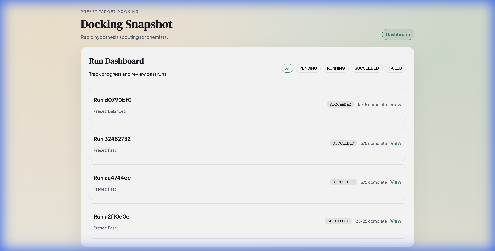
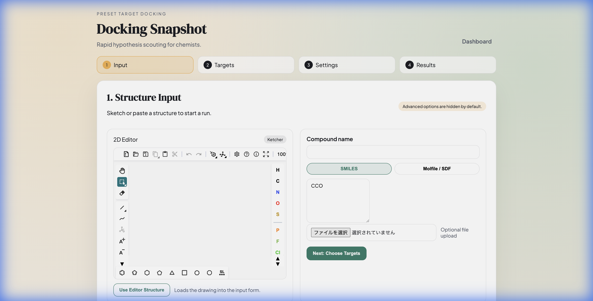
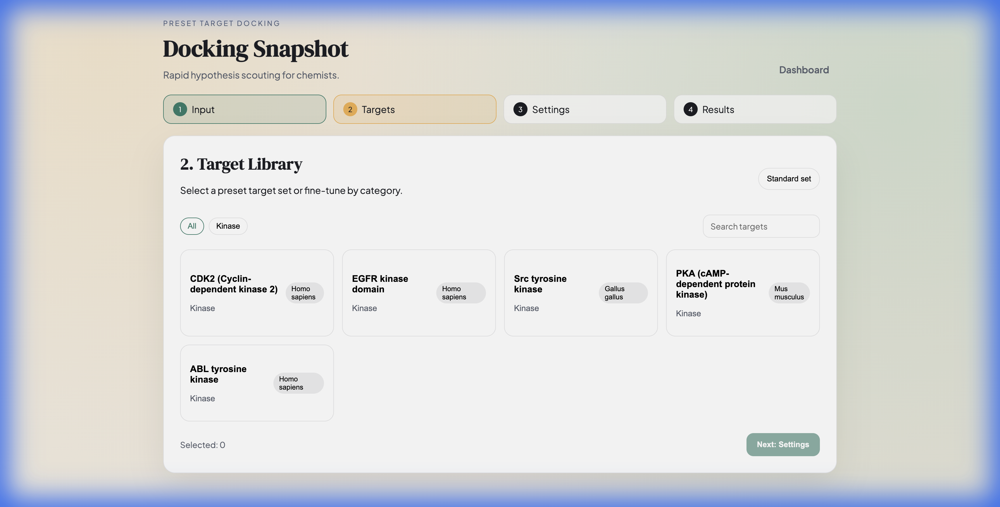
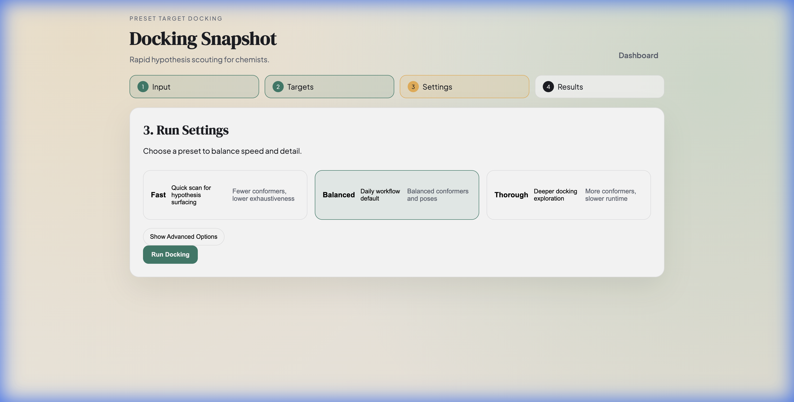
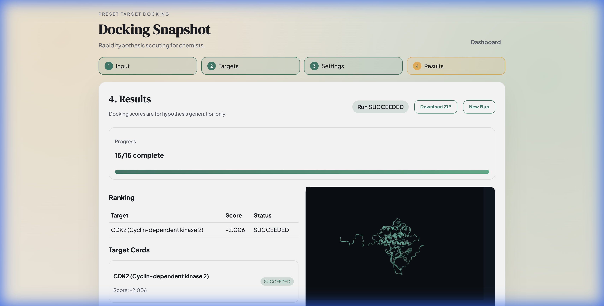

# Simple Docking Dashboard ユーザーガイド

**バージョン**: 0.8.0
**最終更新**: 2026-01-11

---

## 目次

1. [はじめに](#はじめに)
2. [インストール](#インストール)
3. [クイックスタート](#クイックスタート)
4. [UI操作ガイド](#ui操作ガイド)
5. [使用例](#使用例)
6. [トラブルシューティング](#トラブルシューティング)
7. [FAQ](#faq)
8. [用語集](#用語集)

---

## はじめに

### このガイドについて

このガイドは、Simple Docking Dashboard を使って分子ドッキング計算を実行する研究者・化学者のためのマニュアルです。技術的な背景知識がなくても、ブラウザから簡単にドッキング計算を実行できるよう設計されています。

### Simple Docking Dashboard とは

Simple Docking Dashboard は、化合物（リガンド）とタンパク質（レセプター）のドッキング計算を Web ブラウザから実行できるツールです。業界標準の AutoDock Vina を使用した実計算を行います。

#### 主な機能

- ✅ **簡単な入力**: SMILES または Molfile 形式で化合物を入力
- ✅ **キナーゼライブラリ**: 5つの実キナーゼ構造を搭載
- ✅ **カスタムタンパク質**: PDB ID からの直接インポート / PDB テキスト貼り付け
- ✅ **4ステップウィザード**: 入力 → ターゲット → 設定 → 結果
- ✅ **実計算**: AutoDock Vina による実際のドッキング計算
- ✅ **結果ダウンロード**: PDBQT 形式で結果を取得
- ✅ **実行履歴管理**: 過去の計算結果を一覧表示

#### 対象ユーザー

- 創薬研究者
- 計算化学者
- 学生（化学・生物学）
- 化合物スクリーニング担当者

#### システム要件

- **OS**: Linux（Ubuntu、Fedora など）、macOS
- **ソフトウェア**: Docker 20.10+、Docker Compose V2+
- **ブラウザ**: Chrome、Firefox、Safari など
- **メモリ**: 4GB 以上推奨
- **ディスク**: 5GB 以上の空き容量

---

## インストール

### 方法1: 自動インストーラー（推奨）

最も簡単な方法です。

#### Linux / macOS

1. ターミナルを開く

2. 以下のコマンドを実行：

```bash
curl -fsSL https://github.com/knagamatsu/simple-docking/releases/latest/download/simple-docking-installer.sh | bash
```

3. 自動的にインストールと起動が完了します

4. ブラウザで http://localhost:8090/simple-docking を開く

---

### 方法2: 手動インストール

Docker に慣れている場合の手順です。

#### ステップ1: Docker のインストール

**Ubuntu**:
```bash
sudo apt update
sudo apt install docker.io docker-compose-v2
```

**Fedora**:
```bash
sudo dnf install docker docker-compose
```

**macOS**:
- [Docker Desktop for Mac](https://www.docker.com/products/docker-desktop) をインストール

#### ステップ2: リポジトリの取得

```bash
git clone https://github.com/knagamatsu/simple-docking.git
cd simple-docking
```

#### ステップ3: 起動

```bash
./start.sh
```

または：

```bash
docker compose up -d
```

#### ステップ4: アクセス

ブラウザで http://localhost:8090/simple-docking を開く

---

### インストール確認

正しくインストールできたか確認します。

```bash
# サービス状態の確認
docker compose ps
```

すべてのサービスが "Up" 状態なら成功です：

```
NAME                        STATUS
simple-docking-api-1        Up
simple-docking-broker-1     Up
simple-docking-db-1         Up
simple-docking-frontend-1   Up
simple-docking-gateway-1    Up
simple-docking-worker-1     Up
```

---

## クイックスタート

最初のドッキング計算を 5 分で実行できます。

### ステップ1: システム起動

```bash
./start.sh
```

ブラウザが自動的に開きます。または手動で http://localhost:8090/simple-docking にアクセス。

---

### ステップ2: 新規実行の開始

ダッシュボード画面で「**新規実行**」ボタンをクリック。

---

### ステップ3: リガンド入力

**アスピリンをテスト**:

1. **SMILES** を選択
2. 以下をコピー&ペースト:
   ```
   CC(=O)OC1=CC=CC=C1C(=O)O
   ```
3. **名前**: `Aspirin Test`
4. 「**次へ**」をクリック

---

### ステップ4: ターゲット選択

1. **CDK2 (Cyclin-dependent kinase 2)** を選択
2. 「**次へ**」をクリック

---

### ステップ5: 設定

1. **プリセット**: `Fast`（初回は高速テスト用）
2. 「**実行**」をクリック

---

### ステップ6: 結果確認

- 進捗バーが表示されます（1-3分で完了）
- 完了すると、ドッキングスコアが表示されます
- **スコア例**: `-7.2 kcal/mol`（良好な結合）
- 「**結果をダウンロード**」で PDBQT ファイルを取得

---

## UI操作ガイド

### ダッシュボード画面


<!-- TODO: スクリーンショット追加 -->

#### 画面構成

- **ヘッダー**: アプリケーション名とナビゲーション
- **フィルター**: ステータス別（All / Pending / Running / Succeeded / Failed）
- **実行リスト**: 過去の計算結果
- **新規実行ボタン**: 新しいドッキングを開始

#### 操作

| 操作 | 説明 |
|------|------|
| 「**新規実行**」ボタン | 新しいドッキング計算を開始 |
| ステータスチップをクリック | 表示をフィルター |
| Run ID をクリック | 詳細ページへ遷移 |
| 「**Dashboard**」リンク | トップに戻る |

#### 表示情報

- **Run ID**: 実行の識別子（先頭8文字表示）
- **Status**: 実行状態（Pending / Running / Succeeded / Failed）
- **Preset**: 使用した設定（Fast / Balanced / Thorough）
- **Progress**: 完了タスク数 / 全タスク数

---

### リガンド入力画面（ステップ1）


<!-- TODO: スクリーンショット追加 -->

#### 入力方法

##### 1. SMILES 入力（推奨）

**SMILES とは**: 分子を文字列で表現する形式

**入力例**:
```
CC(=O)OC1=CC=CC=C1C(=O)O  ← アスピリン
CN1C=NC2=C1C(=O)N(C(=O)N2C)C  ← カフェイン
```

**取得方法**:
- [PubChem](https://pubchem.ncbi.nlm.nih.gov/)
- [ChemSpider](http://www.chemspider.com/)
- ChemDraw（Tools → Generate → SMILES）

**制限**:
- 最大 1000 文字

##### 2. Molfile 入力

**Molfile とは**: 分子構造を座標付きで記述する形式

**入力方法**:
1. ChemDraw や MarvinSketch で分子を描画
2. File → Save As → MDL Molfile (V2000 または V3000)
3. ファイルの内容をコピー&ペースト

**制限**:
- 最大 100KB

##### 3. Ketcher エディタ（グラフィカル入力）

**Ketcher とは**: ブラウザ内で動作する 2D 分子エディタ

**使い方**:
1. 「**Ketcher Editor**」タブをクリック
2. ツールバーで原子や結合を選択
3. マウスで分子を描画
4. 完了したら自動的に SMILES が生成される

**主なツール**:
- **Atom**: 原子の追加（C、N、O など）
- **Bond**: 結合の追加（単結合、二重結合など）
- **Chain**: 炭素鎖の追加
- **Erase**: 削除

#### フォームフィールド

| フィールド | 必須 | 説明 |
|-----------|------|------|
| SMILES / Molfile | ✅ | どちらか一方を入力 |
| 名前 | ❌ | わかりやすい名前（例: Aspirin Test） |

---

### ターゲット選択画面（ステップ2）


<!-- TODO: スクリーンショット追加 -->

#### 利用可能なタンパク質

| タンパク質 | PDB ID | 分類 | 説明 |
|-----------|--------|------|------|
| **CDK2** | 1M17 | Kinase | 細胞周期調節、がん標的。ATP結合部位。 |
| **EGFR** | 4I23 | Kinase | 上皮成長因子受容体、がん標的。阻害剤結合部位。 |
| **Src** | 2SRC | Kinase | がん原遺伝子、シグナル伝達。ATP結合部位。 |
| **PKA** | 1ATP | Kinase | シグナル伝達、古典的キナーゼ例。ATP結合部位。 |
| **ABL** | 1IEP | Kinase | 白血病標的（Gleevec/Imatinib）。阻害剤結合部位。 |

#### プリセット

- **All targets**: すべての登録ターゲットを一括選択
- **Kinase panel**: Kinase カテゴリのみを選択（基準パネル）
- **Oncology core**: EGFR / ABL / Src / CDK2 を一括選択
- **Signal transduction**: EGFR / Src / PKA を一括選択
- **Custom**: インポート／貼り付けで追加したターゲットのみを選択

#### 操作

1. 上部のプリセットボタンで一括選択
2. タンパク質カードをクリックして個別に調整（ハイライト表示）
3. 「**次へ**」で設定画面へ

#### タンパク質の選び方

| 目的 | 推奨ターゲット |
|------|--------------|
| テスト | CDK2（計算が速い） |
| キナーゼ阻害剤 | 対応するキナーゼを選択 |
| 汎用スクリーニング | すべてで実行して比較 |
| Gleevec類似物 | ABL |

#### カスタムタンパク質の追加

- **PDB ID からインポート**: 4文字の PDB ID を入力して取得
- **PDB テキスト貼り付け**: 手元の PDB ファイルをそのまま貼り付け
- 追加したターゲットはカテゴリ **Custom** として表示されます

---

### 設定画面（ステップ3）


<!-- TODO: スクリーンショット追加 -->

#### プリセット

| プリセット | コンフォマー数 | Exhaustiveness | ポーズ数 | 実行時間 | 用途 |
|-----------|--------------|----------------|---------|---------|------|
| **Fast** | 5 | 4 | 5 | 1-3分 | テスト、探索 |
| **Balanced** | 15 | 8 | 10 | 3-10分 | 通常計算 |
| **Thorough** | 30 | 16 | 20 | 10-30分 | 詳細解析 |

#### パラメータ詳細

**コンフォマー数**:
- リガンドの異なる3D構造を生成する数
- 多いほど多様な構造を試せる

**Exhaustiveness**:
- Vina の探索精度
- 大きいほど精密だが計算時間が長い

**ポーズ数**:
- 出力する結合構造の数
- 多いほど選択肢が増える

#### 推奨設定

- **初回テスト**: Fast
- **日常的な計算**: Balanced
- **論文用データ**: Thorough

---

### 結果画面（ステップ4）


<!-- TODO: スクリーンショット追加 -->

#### 表示内容

##### 実行ステータス

| ステータス | 意味 | 次のアクション |
|-----------|------|--------------|
| **Pending** | 待機中 | しばらく待つ |
| **Running** | 計算中 | 進捗を確認 |
| **Completed** | 完了 | 結果をダウンロード |
| **Failed** | 失敗 | エラーログ確認 |

##### 結果表の見方

| 列 | 説明 |
|----|------|
| **Conformer** | コンフォマー番号 |
| **Score** | ドッキングスコア（kcal/mol） |
| **Pose** | ポーズファイルのダウンロードリンク |

##### スコアの解釈

| スコア範囲 | 評価 |
|-----------|------|
| -9.0 以下 | 非常に強い結合 |
| -7.0 〜 -9.0 | 良好な結合 |
| -5.0 〜 -7.0 | 中程度の結合 |
| -5.0 以上 | 弱い結合 |

#### 操作

| ボタン | 機能 |
|--------|------|
| **結果をダウンロード** | すべての結果を ZIP でダウンロード |
| 個別 **Download** | 特定のポーズをダウンロード |
| **Dashboard** | ダッシュボードに戻る |

#### ダウンロードファイル

**ZIP ファイルの内容**:
```
results.zip
├── ligand.pdbqt          ← リガンド（PDBQT形式）
├── task_1/
│   ├── pose_0.pdbqt      ← ポーズ0
│   ├── pose_1.pdbqt
│   └── vina.log          ← Vinaログ
├── task_2/
│   └── ...
```

**可視化方法**:
- [PyMOL](https://pymol.org/)
- [Chimera](https://www.cgl.ucsf.edu/chimera/)
- [AutoDockTools](http://autodock.scripps.edu/)

---

## 使用例

### 例1: 既知の阻害剤をテスト

**目的**: Gleevec（イマチニブ）と ABL の結合を確認

#### 手順

1. **リガンド入力**:
   - SMILES: `CN1CCN(CC1)CC2=CC=C(C=C2)C(=O)NC3=CC(=C(C=C3)NC4=NC=CC(=N4)C5=CN=CC=C5)C(F)(F)F`
   - 名前: `Gleevec (Imatinib)`

2. **ターゲット**: ABL (1IEP)

3. **設定**: Balanced

4. **期待される結果**:
   - スコア: 約 -9.5 kcal/mol（非常に強い結合）
   - これは Gleevec が ABL の強力な阻害剤であることを反映

---

### 例2: 複数のターゲットでスクリーニング

**目的**: 新規化合物が複数のキナーゼに対してどう結合するか調査

#### 手順

1. 同じ化合物（SMILES）で 5 回実行
   - Run 1: CDK2
   - Run 2: EGFR
   - Run 3: Src
   - Run 4: PKA
   - Run 5: ABL

2. ダッシュボードで結果を比較

3. 最良のスコアを特定

#### 結果例

| ターゲット | スコア | 評価 |
|-----------|--------|------|
| CDK2 | -8.2 | 良好 |
| EGFR | -6.5 | 中程度 |
| Src | -7.8 | 良好 |
| PKA | -5.2 | 弱い |
| ABL | -9.1 | 最良 |

**結論**: この化合物は ABL に最も強く結合する

---

### 例3: バッチ処理（API経由）

**目的**: 複数の化合物を自動的にテスト

#### スクリプト例

```bash
#!/bin/bash
# ligands.txt に SMILES のリスト

while IFS= read -r smiles; do
  echo "Processing: $smiles"

  # リガンド作成
  ligand_id=$(curl -s -X POST http://localhost:8090/simple-docking/api/ligands \
    -H "Content-Type: application/json" \
    -d "{\"smiles\": \"$smiles\"}" | jq -r '.ligand_id')

  # 実行作成
  curl -X POST http://localhost:8090/simple-docking/api/runs \
    -H "Content-Type: application/json" \
    -d "{\"ligand_id\": $ligand_id, \"protein_id\": \"prot_cdk2\", \"preset\": \"fast\"}"

  sleep 1
done < ligands.txt
```

**ligands.txt**:
```
CC(=O)OC1=CC=CC=C1C(=O)O
CN1C=NC2=C1C(=O)N(C(=O)N2C)C
CC(C)Cc1ccc(cc1)C(C)C(=O)O
```

---

## トラブルシューティング

### 起動できない

#### 症状
`./start.sh` がエラーになる、または何も起こらない

#### 原因と対処

##### 1. Docker が起動していない

**確認**:
```bash
docker ps
```

**エラー**: `Cannot connect to the Docker daemon`

**対処**:
```bash
# Dockerを起動
sudo systemctl start docker

# 自動起動を有効化
sudo systemctl enable docker
```

##### 2. Docker Compose がない

**確認**:
```bash
docker compose version
```

**エラー**: `command not found`

**対処**:
```bash
# Ubuntu/Debian
sudo apt install docker-compose-v2

# Fedora
sudo dnf install docker-compose
```

##### 3. 権限エラー

**エラー**: `permission denied while trying to connect`

**対処**:
```bash
# ユーザーを docker グループに追加
sudo usermod -aG docker $USER

# グループを再読み込み
newgrp docker

# 再起動
./start.sh
```

---

### ブラウザに表示されない

#### 症状
http://localhost:8090/simple-docking が開けない

#### 対処手順

##### 1. サービス状態を確認

```bash
docker compose ps
```

すべて "Up" か確認。

##### 2. ログを確認

```bash
docker compose logs gateway
docker compose logs frontend
```

##### 3. ポート8090が使用中でないか確認

```bash
sudo lsof -i :8090
```

他のプログラムが使用中の場合、停止するか、ポート番号を変更：

```yaml
# docker-compose.yml
gateway:
  ports:
    - "8091:80"  # 8090 → 8091 に変更
```

##### 4. ブラウザのキャッシュをクリア

- Ctrl+Shift+Delete でキャッシュをクリア
- シークレットモードで試す

---

### ドッキングが失敗する

#### 症状
ステータスが "FAILED" になる

#### 原因と対処

| 原因 | 症状 | 対処法 |
|------|------|--------|
| **無効なSMILES** | "Invalid SMILES" エラー | SMILES文字列を確認、PubChemで検証 |
| **分子が大きすぎる** | PDBQT変換失敗 | より小さい分子でテスト |
| **タイムアウト** | 長時間待機後失敗 | プリセットを Fast に変更 |
| **メモリ不足** | Worker crash | Dockerのメモリ割り当てを増やす |

#### ログ確認

```bash
# Workerのログを確認
docker compose logs worker

# 特定の実行のログ
docker compose logs worker | grep "run_id=123"
```

---

### 結果がダウンロードできない

#### 症状
「ダウンロード」ボタンが機能しない、またはエラーになる

#### 対処

1. **計算が完了しているか確認**
   - ステータス: Completed

2. **ブラウザのポップアップブロックを確認**
   - ブラウザの設定でポップアップを許可

3. **別のブラウザで試す**
   - Chrome、Firefox、Safari

4. **APIで直接ダウンロード**
   ```bash
   curl -O http://localhost:8090/simple-docking/api/runs/{run_id}/export
   ```

---

### パフォーマンスが遅い

#### 症状
計算に異常に時間がかかる

#### 対処

1. **プリセットを Fast に変更**

2. **Dockerのリソースを増やす**
   - Docker Desktop → Settings → Resources
   - CPUs: 4+
   - Memory: 4GB+

3. **並列実行を制限**
   - 同時に多数の計算を実行している場合、順次実行に変更

---

## FAQ

### Q1: SMILES と Molfile の違いは？

**A**:

| 形式 | 特徴 | 例 |
|------|------|---|
| **SMILES** | 文字列形式、簡潔 | `CC(=O)O`（酢酸） |
| **Molfile** | 座標情報を含む | ChemDraw 出力 |

どちらでも同じ計算結果が得られます。SMILES の方が簡単で推奨。

---

### Q2: ドッキングスコアの意味は？

**A**:

- **単位**: kcal/mol
- **解釈**: 値が小さい（マイナスが大きい）ほど結合が強い
- **目安**:
  - **-7.0 以下**: 良好な結合
  - **-9.0 以下**: 非常に強い結合
  - **-5.0 以上**: 弱い結合

**注意**: スコアだけで判断せず、実験的検証も必要です。

---

### Q3: 自分のタンパク質を追加できる？

**A**:

現在のバージョン（MVP）では、プリセットの 5 つのキナーゼのみ対応しています。

将来のバージョンでカスタムタンパク質アップロード機能を追加予定（`docs/roadmap.md` 参照）。

---

### Q4: 結果ファイルの使い方は？

**A**:

ダウンロードした PDBQT ファイルは以下で可視化できます：

- **PyMOL**: `pymol protein.pdbqt ligand.pdbqt`
- **Chimera**: File → Open → PDBQT
- **AutoDockTools**: 詳細な相互作用解析

---

### Q5: 並列実行は可能？

**A**:

はい。複数のドッキング計算を同時に実行できます。Worker が自動的にキューを処理します。

**制限**: システムリソース（CPU、メモリ）に依存。推奨は同時 3-5 件。

---

### Q6: 認証は必要？

**A**:

現在のバージョンでは不要です（MVP）。ローカル環境での使用を想定しています。

将来のバージョンでユーザー認証を追加予定（クラウド公開時）。

---

### Q7: コマンドラインから実行できる？

**A**:

はい、REST API 経由で可能です。

**例**:

```bash
# リガンド作成
curl -X POST http://localhost:8090/simple-docking/api/ligands \
  -H "Content-Type: application/json" \
  -d '{"smiles": "CC(=O)OC1=CC=CC=C1C(=O)O", "name": "Aspirin"}'

# 実行作成
curl -X POST http://localhost:8090/simple-docking/api/runs \
  -H "Content-Type: application/json" \
  -d '{"ligand_id": 1, "protein_id": "prot_cdk2", "preset": "fast"}'

# 状態確認
curl http://localhost:8090/simple-docking/api/runs/1/status
```

詳細: http://localhost:8090/simple-docking/api/docs

---

### Q8: 停止方法は？

**A**:

```bash
# サービスを停止（データ保持）
docker compose down

# データも削除して完全リセット
docker compose down -v
```

---

### Q9: どのくらい正確？

**A**:

AutoDock Vina は広く使われているドッキングソフトウェアで、多くの論文で引用されています。

**精度**:
- 結合ポーズ予測: 約 70-80%
- スコアと実測の相関: 中程度

**推奨**: ドッキング結果は仮説生成に使い、必ず実験で検証してください。

---

### Q10: 商用利用は可能？

**A**:

AutoDock Vina は Apache License 2.0 でライセンスされており、商用利用可能です。

このダッシュボードのライセンスは `docs/licenses.md` を参照してください。

---

## 用語集

### ドッキング関連

**分子ドッキング (Molecular Docking)**
化合物とタンパク質の結合様式を計算によって予測する手法。創薬のスクリーニングに使用される。

**リガンド (Ligand)**
タンパク質に結合する小分子（化合物）。薬の候補となる化合物。

**レセプター (Receptor)**
リガンドが結合するタンパク質。薬のターゲットとなる。

**ドッキングスコア (Docking Score)**
結合の強さを表す数値（kcal/mol）。小さいほど結合が強い。

**ポーズ (Pose)**
リガンドとタンパク質の結合構造。3D 座標。

**コンフォマー (Conformer)**
分子の立体配座（異なる 3D 構造）。回転可能な結合によって生じる。

**結合部位 (Binding Site)**
タンパク質上でリガンドが結合する領域。

**ポケット (Pocket)**
結合部位の凹み（ポケット状の空間）。リガンドが入る場所。

---

### ファイル形式

**SMILES (Simplified Molecular Input Line Entry System)**
分子を文字列で表現する形式。簡潔で扱いやすい。
例: `CC(=O)O`（酢酸）、`c1ccccc1`（ベンゼン）

**Molfile**
分子構造を座標付きで記述するファイル形式。ChemDraw などから出力される。

**PDBQT**
AutoDock / Vina 用のタンパク質・リガンドファイル形式。電荷とトーションが含まれる。

**PDB (Protein Data Bank)**
タンパク質構造データベースおよびそのファイル形式。

---

### タンパク質関連

**キナーゼ (Kinase)**
リン酸化反応を触媒する酵素ファミリー。創薬の重要ターゲット。がんなどの疾患に関与。

**ATP (Adenosine Triphosphate)**
細胞のエネルギー通貨。多くのキナーゼが ATP 結合部位を持つ。

**阻害剤 (Inhibitor)**
タンパク質の活性を阻害する化合物。薬として機能することが多い。

---

### 計算パラメータ

**Exhaustiveness**
Vina の探索精度パラメータ（デフォルト: 8）。大きいほど精密だが計算時間が長い。

**プリセット (Preset)**
計算設定の組み合わせ（Fast / Balanced / Thorough）。用途に応じて選択。

**Conformer Generation**
3D コンフォマーを生成する処理。RDKit が実行。

---

### システム用語

**Docker**
コンテナ技術。アプリケーションを隔離された環境で実行。

**Docker Compose**
複数のコンテナを管理するツール。このプロジェクトは 6 つのコンテナで構成。

**REST API**
HTTP 経由でデータをやり取りするインターフェース。ブラウザ以外からも利用可能。

---

## サポート

### 問題が解決しない場合

1. **GitHub Issues**: https://github.com/knagamatsu/simple-docking/issues
2. **ドキュメント**: `docs/` ディレクトリの他のファイルを参照
3. **開発者向け**: `AGENTS.md` を参照

### 関連ドキュメント

- [README.md](../README.md) - プロジェクト概要
- [VERIFICATION.md](../VERIFICATION.md) - 検証手順（開発者向け）
- [docs/architecture.md](./architecture.md) - システム構成
- [docs/deploy.md](./deploy.md) - デプロイ手順
- [docs/roadmap.md](./roadmap.md) - 開発ロードマップ

---

**Simple Docking Dashboard をお楽しみください！**
